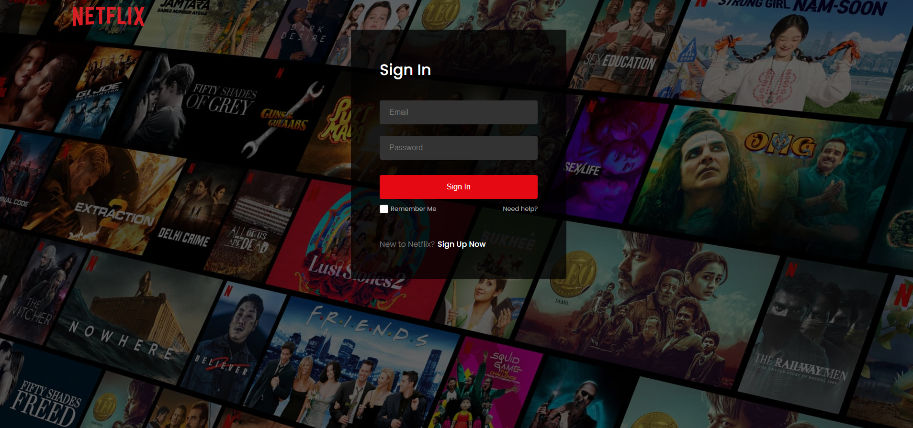
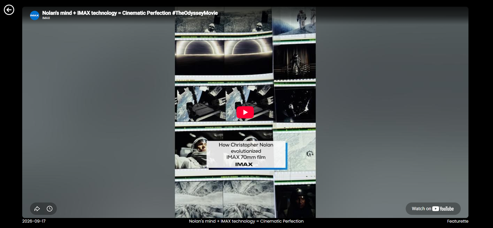

# Netflix Clone

A Netflix-style streaming UI with real accounts and live movie data. Users sign up or sign in, browse rows of movies pulled from TMDB, and play trailers.

**[Live site →](https://brenthippler-art.github.io/Netflix-Clone/)**

## The problem

Rebuild the core Netflix experience with real data and real user accounts, and deploy it as a single-page app on GitHub Pages, which doesn't support client-side routing out of the box.

## My contribution

Solo build.

- Sign-up, sign-in, and sign-out with Firebase Authentication, with friendly error messages shown as toasts
- Route protection: signed-out users are sent to the login page automatically
- Category rows (now playing, popular, top rated, upcoming) pulled live from the TMDB API
- Horizontally scrolling rows that also respond to the mouse wheel
- A trailer player page that loads each movie's trailer from TMDB
- Deployment to GitHub Pages with working deep links

## Tech stack

React, Vite, React Router, Firebase Authentication and Firestore, TMDB API, React Toastify, GitHub Pages

## Screenshots




## Technical decisions

### Making client-side routing work on GitHub Pages
GitHub Pages only serves real files, so refreshing a route like `/player/123` returned a 404. A `basename` on the router plus a `404.html` redirect sends any unknown path back to the app with the original route intact, so deep links and refreshes work.

### Moving the API credential out of the code, and out of git history
The TMDB credential was originally hard-coded. I moved it into an environment variable and used `git filter-repo` to remove it from the repository's entire history, since deleting it in a new commit would have left it visible in older ones.

### Auth state drives navigation
A single `onAuthStateChanged` listener at the top of the app decides where users go: signed-in users to the home page, everyone else to the login page. Route protection lives in one place instead of being repeated on every page.

## Accessibility and testing

- Images and icons have `alt` text
- Tested sign-up, sign-in, error messages for bad credentials, sign-out, and trailer playback on the live GitHub Pages build, including refreshing deep links
- **Known gaps:** rows are scrolled with a mouse wheel or trackpad, and keyboard navigation through the cards is limited. Some clickable icons are images rather than buttons.
- **No automated test suite yet.**

## Setup

```bash
git clone https://github.com/brenthippler-art/Netflix-Clone.git
cd Netflix-Clone
npm install
```

Create a `.env` file with your own TMDB API read access token:

```
VITE_TMDB_TOKEN=your_token_here
```

Update the Firebase config in `src/firebase.js` to point to your own Firebase project, then run:

```bash
npm run dev
```

`npm run deploy` builds the app and publishes it to GitHub Pages.

## Live link

[brenthippler-art.github.io/Netflix-Clone](https://brenthippler-art.github.io/Netflix-Clone/)

## Author

**Brenton Hippler:** [Portfolio](https://brentoncodes.dev) · [LinkedIn](https://www.linkedin.com/in/brenton-hippler-818b6397) · [GitHub](https://github.com/brenthippler-art)